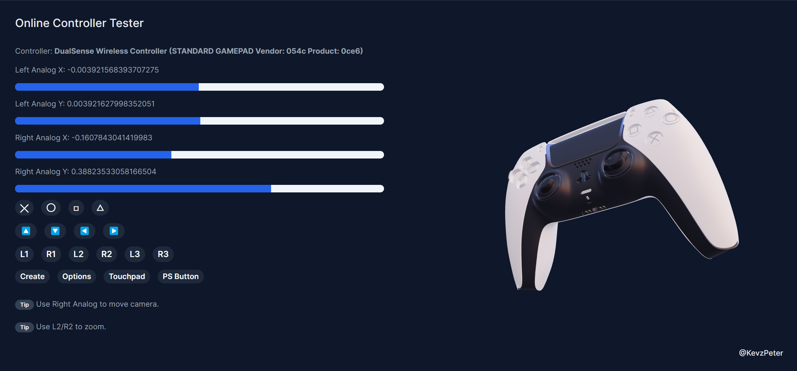

<!-- PROJECT LOGO -->
 

  

  <h3 align="center">Online Controller Tester</h3>

  

    🎮 Test your Playstation DualSense or Xbox Controllers using this interactive 3D visualization!
     
     
    <a href="https://online-controller-tester.vercel.app/">✨ View Demo</a>
    ·
    <a href="https://github.com/KevzPeter/online-controller-tester/issues">🐛 Report Bug</a>
    ·
    <a href="https://github.com/KevzPeter/online-controller-tester/issues">💁🏽 Request Feature</a>
  

<!-- DEMO -->
## Demo

<!-- ENHANCEMENTS -->
## Planned Enhancements

- [x] Support for Xbox Controllers
- [x] Add 3D Xbox Controller model
- [] Make 3D model interactive 
    - [] Highlight active buttons
    - [] Movable analog sticks

<!-- CONTRIBUTING -->
## Contributing

If you'd like to add enhancements, please fork the repo and create a pull request. You can also open an issue with the tag "enhancement".
Don't forget to give the project a star! Thanks again!

1. Fork the Project
2. Create your Feature Branch (`git checkout -b feature/AmazingFeature`)
3. Commit your Changes (`git commit -m 'Add some AmazingFeature'`)
4. Push to the Branch (`git push origin feature/AmazingFeature`)
5. Open a Pull Request

(<a href="#readme-top">back to top</a>)

<!-- MARKDOWN LINKS & IMAGES -->
<!-- https://www.markdownguide.org/basic-syntax/#reference-style-links -->
[contributors-shield]: https://img.shields.io/github/contributors/othneildrew/Best-README-Template.svg?style=for-the-badge
[contributors-url]: https://github.com/othneildrew/Best-README-Template/graphs/contributors
[forks-shield]: https://img.shields.io/github/forks/othneildrew/Best-README-Template.svg?style=for-the-badge
[forks-url]: https://github.com/othneildrew/Best-README-Template/network/members
[stars-shield]: https://img.shields.io/github/stars/othneildrew/Best-README-Template.svg?style=for-the-badge
[stars-url]: https://github.com/othneildrew/Best-README-Template/stargazers
[issues-shield]: https://img.shields.io/github/issues/othneildrew/Best-README-Template.svg?style=for-the-badge
[issues-url]: https://github.com/othneildrew/Best-README-Template/issues
[license-shield]: https://img.shields.io/github/license/othneildrew/Best-README-Template.svg?style=for-the-badge
[license-url]: https://github.com/othneildrew/Best-README-Template/blob/master/LICENSE.txt
[product-screenshot]: images/screenshot.png
[Next.js]: https://img.shields.io/badge/next.js-000000?style=for-the-badge&logo=nextdotjs&logoColor=white
[Next-url]: https://nextjs.org/
[React.js]: https://img.shields.io/badge/React-20232A?style=for-the-badge&logo=react&logoColor=61DAFB
[React-url]: https://reactjs.org/
[Docker]: https://img.shields.io/badge/docker-%230db7ed.svg?style=for-the-badge&logo=docker&logoColor=white
[Docker-url]: https://docker.com/